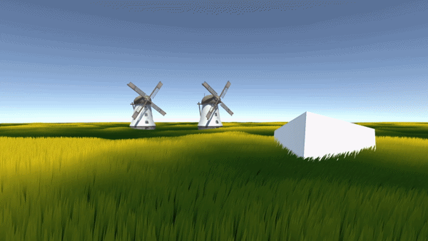

# Grass Rendering and Optimization
A collection of **Grass Rendering Approaches** and **Optimization Techniques**.

## Grass Cards + Billboad Grass

### Optimization Techniques Used
* GPU Instancing
* Grass CPU Distance Culling
* Grass CPU Frustum Culling
* Billboarding
* Level Of Detail(LOD)

## Model Grass

### Optimization Techniques Used
* GPU Instancing
* Chunking
* Chunk GPU Distance Culling
* Chunk GPU AABB Frustum Culling
* Skipping Updates/Dispatch Calls on Culled Chunks
* Grass GPU Distance Culling
* Grass GPU Frustum Culling
* Grass GPU Occlusion Culling
* Level Of Detail(LOD)

## Additional Features
* Scrolling Noise Texture for Wind Simulation
* Grass Animation based on Grass Height
* Options for Real-Time Adjustment of: Culling, Grass Appearance, Wind Properties 

## Resources Used
- [Acerola](https://www.youtube.com/watch?v=Y0Ko0kvwfgA)
- [GPU Gems](https://developer.nvidia.com/gpugems/gpugems/part-i-natural-effects/chapter-7-rendering-countless-blades-waving-grass)
- [Game Dev Guide](https://www.youtube.com/watch?v=BrZ4pWwkpto)
- [Procedural Grass in 'Ghost of Tsushima'](https://youtu.be/Ibe1JBF5i5Y?si=qhWIgLrL43eIUy0a)
- [Sapra Projects](https://ensapra.com/2023/11/comparing-performances-of-diferent-vegetation-systems)
- [ColinLeung-NiloCat](https://github.com/ColinLeung-NiloCat/UnityURP-MobileDrawMeshInstancedIndirectExample)
- [Windmill Model](https://sketchfab.com/3d-models/windmill-0730705327e045bd8cb98a888bd0f954)
